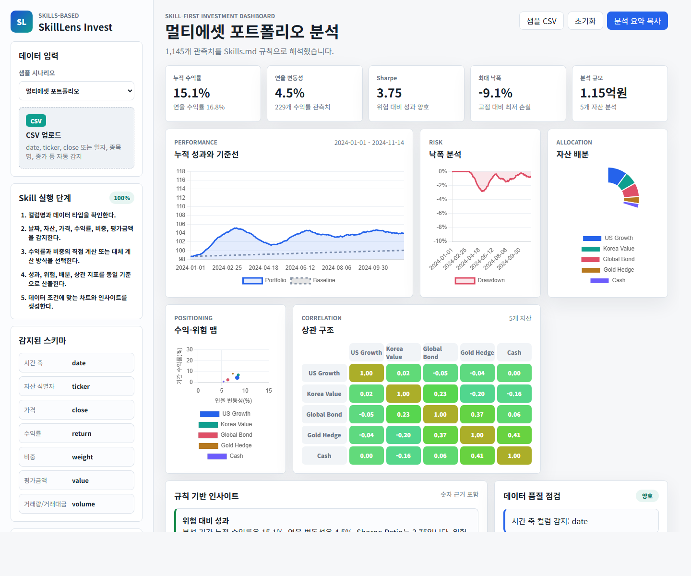

# SkillLens Invest

Skills.md 규칙을 기반으로 투자 데이터 CSV의 구조를 자동 감지하고, 성과·위험·배분·상관관계 대시보드를 생성하는 정적 웹앱입니다.



## 주요 기능

- 샘플 데이터 5종 제공
  - 멀티에셋 포트폴리오
  - ETF 섹터 로테이션
  - 단일 종목 리스크 진단
  - 비표준 한글 컬럼 CSV
  - 불완전 데이터 처리
- CSV 업로드 후 컬럼 자동 감지
- 가격 기반 수익률, 평가금액 비중, 동일 비중 등 대체 계산 규칙 표시
- 누적 수익률, 연율 수익률, 변동성, Sharpe Ratio, 최대 낙폭 계산
- 성과, 낙폭, 배분, 수익-위험, 상관 구조 차트 생성
- 데이터 품질 점검 및 규칙 기반 인사이트 제공

## 실행 방법

정적 파일만으로 동작하므로 `index.html`을 브라우저에서 열 수 있습니다. 로컬 서버로 확인하려면 아래 명령을 사용합니다.

```powershell
python -m http.server 4173
```

접속 주소:

```text
http://localhost:4173
```

## 프로젝트 구조

```text
.
├── docs/
│   ├── preview.png
│   └── proposal.pdf
├── index.html
├── styles.css
├── app.js
├── Skills.md
├── SUBMISSION_PLAN.md
├── README.md
└── .gitignore
```

## 배포

GitHub Pages, Netlify, Vercel 같은 정적 호스팅에 그대로 배포할 수 있습니다. 외부 API 키가 필요하지 않으며, CSV 분석은 브라우저에서 수행됩니다.

## 투자 정보 고지

이 서비스는 업로드된 데이터에 대한 통계적 분석과 시각화를 제공하는 도구입니다. 생성된 인사이트는 투자 조언이 아니라 데이터 기반 요약 정보입니다.
